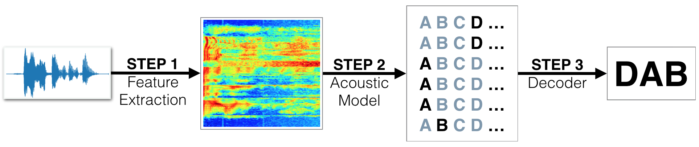

# Automatic Speech Recognition (ASR)

## Project Overview

we will build a deep neural network that functions as part of an end-to-end automatic speech recognition (ASR) pipeline! The completed pipeline will accept raw audio as input and return a predicted transcription of the spoken language. The full pipeline is summarized in the figure below.

- **STEP 1** is a pre-processing step that converts raw audio to one of two feature representations that are commonly used for ASR. 
- **STEP 2** is an acoustic model which accepts audio features as input and returns a probability distribution over all potential transcriptions.  After learning about the basic types of neural networks that are often used for acoustic modeling, we will engage in our own investigations, to design your own acoustic model!
- **STEP 3** in the pipeline takes the output from the acoustic model and returns a predicted transcription.  

## Dataset

We begin by investigating the [LibriSpeech dataset](http://www.openslr.org/12/) that will be used to train and evaluate your models. The algorithm will first convert any raw audio to feature representations that are commonly used for ASR. We will then move on to building neural networks that can map these audio features to transcribed text. 
